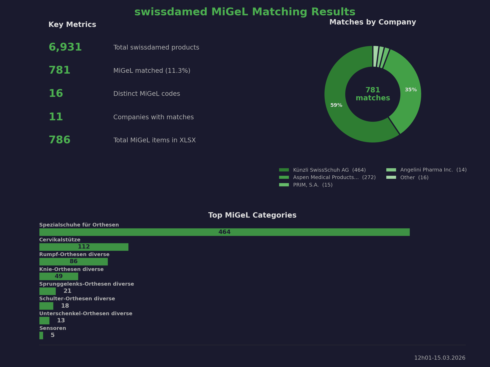

# swissdamed2sqlite

Download swissdamed UDI (Unique Device Identification) data, actors, and mandates from [swissdamed.ch](https://swissdamed.ch) and export as CSV and/or SQLite.

## Installation

Requires Rust toolchain. Then:

```bash
cargo build --release
```

The binary will be at `target/release/swissdamed2sqlite`.

## Usage

```bash
# Download and export both CSV and SQLite (default)
swissdamed2sqlite

# Export only CSV or only SQLite
swissdamed2sqlite --csv
swissdamed2sqlite --sqlite

# Load from a local JSON file instead of downloading
swissdamed2sqlite -f data.json --csv --sqlite

# Customize API page size (default: 50)
swissdamed2sqlite --page-size 100

# Export SQLite and deploy to remote server via scp
swissdamed2sqlite --sqlite --deploy

# Deploy to a custom scp target
swissdamed2sqlite --sqlite --deploy --scp user@host:/path/to/swissdamed.db

# Download actors
swissdamed2sqlite --actors
swissdamed2sqlite --actors --csv       # CSV only

# Download mandates
swissdamed2sqlite --mandates
swissdamed2sqlite --mandates --sqlite  # SQLite only

# Download both actors and mandates
swissdamed2sqlite --actors --mandates

# Join AR actors with their mandates
swissdamed2sqlite --ar-mandates

# CH-REP only companies (only AR/IM roles, no MF/PR under same UID)
swissdamed2sqlite --ch-rep

# MiGeL matching — map UDI devices to MiGeL codes
swissdamed2sqlite --migel
swissdamed2sqlite --migel --deploy

# Diff two CSV files (output to diff/ folder)
swissdamed2sqlite --diff csv/swissdamed_24.02.2026.csv csv/swissdamed_25.02.2026.csv
```

Output files are date-stamped and organized into subdirectories:
- UDI: `csv/swissdamed_25.02.2026.csv` / `db/swissdamed_25.02.2026.db`
- Actors: `csv/actors_25.02.2026.csv` / `db/actors_25.02.2026.db`
- Mandates: `csv/mandates_25.02.2026.csv` / `db/mandates_25.02.2026.db`
- AR Mandates: `csv/ar_mandates_25.02.2026.csv` / `db/ar_mandates_25.02.2026.db`
- CH-REP: `csv/ch_rep_25.02.2026.csv` / `db/ch_rep_25.02.2026.db`

## Output Format

- **CSV** — UTF-8 with BOM for Excel compatibility
- **SQLite** — single table per dataset (all TEXT columns). UDI table indexed on `udiDiCode` and `tradeName_*` columns

The nested `udiDis` array from the UDI API is flattened: each UDI DI entry becomes its own row with a `udiDiCode` column and per-language `tradeName_{lang}` columns.

- **Actors** — flat export from `swissdamed.ch/public/act/actors` (table: `actors`)
- **Mandates** — flat export from `swissdamed.ch/public/act/mandates` (table: `mandates`)
- **AR Mandates** — joins AR-type actors with their mandates into a single table (`ar_mandates`) with `actor_`/`mandate_` prefixed columns. Fetches full mandate details (SRN, mandateType, validFrom/validTo, full address) via the `/public/act/mandates/{id}` detail endpoint
- **CH-REP** — filters actors to companies that only have AR and/or IM roles (no MF or PR under the same `companyUid`). Useful for identifying CH-REP only companies
- **Diff** — compares two CSVs by `udiDiCode`, outputs to `diff/diff_swissdamed_DD.MM.YYYY_DD.MM.YYYY.csv` with a `diff_status` column (`added`, `removed`, `changed_old`, `changed_new`)
- **MiGeL** — matches UDI devices against MiGeL (Mittel- und Gegenständeliste) codes. Uses Aho-Corasick candidate finding, IDF-weighted multi-language scoring, English-to-German medical term translation (~80 terms with context-aware combinations like "ortho"+"rehab"→"spezialschuhe"), and precision filters. Output: `db/swissdamed_migel_DD.MM.YYYY.db`. Auto-generates a stats PNG after each run.

### MiGeL Matching Results



## Dependencies

- [reqwest](https://crates.io/crates/reqwest) — HTTP client (blocking, JSON, cookies)
- [serde](https://crates.io/crates/serde) / [serde_json](https://crates.io/crates/serde_json) — JSON parsing
- [csv](https://crates.io/crates/csv) — CSV output
- [rusqlite](https://crates.io/crates/rusqlite) — SQLite (bundled)
- [calamine](https://crates.io/crates/calamine) — XLSX parsing (MiGeL)
- [rayon](https://crates.io/crates/rayon) — Parallel matching
- [clap](https://crates.io/crates/clap) — CLI argument parsing
- [chrono](https://crates.io/crates/chrono) — Date/time formatting
- [aho-corasick](https://crates.io/crates/aho-corasick) — Multi-pattern string matching
- [unicode-normalization](https://crates.io/crates/unicode-normalization) — Unicode NFC normalization

## License

GPL-3.0 — see [LICENSE](LICENSE).
