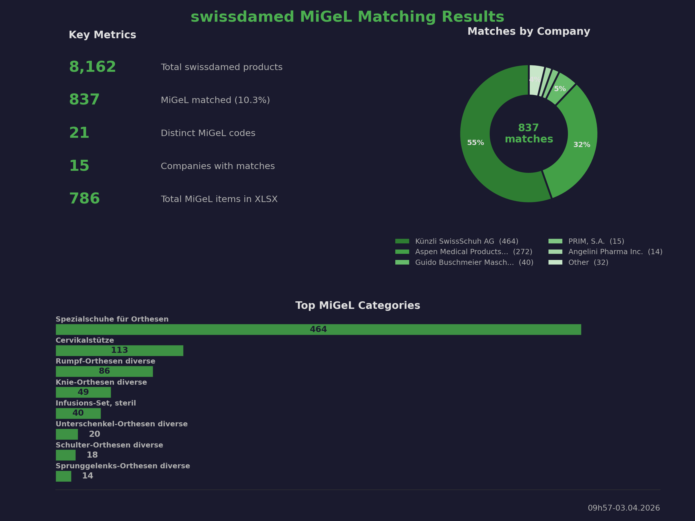

# swissdamed2sqlite

Download swissdamed UDI (Unique Device Identification) data, actors, and mandates from [swissdamed.ch](https://swissdamed.ch) and export as CSV and/or SQLite.

Available as a **cross-platform GUI app** (Windows, macOS, Linux) and as a CLI tool.

## Download

Pre-built binaries for all platforms are available on the [GitHub Releases](https://github.com/zdavatz/swissdamed2sqlite/releases) page:

- **macOS** — Universal DMG (Apple Silicon + Intel), also on the Mac App Store
- **Windows** — Portable ZIP and MSIX installer, also on the Microsoft Store
- **Linux** — tar.gz and AppImage

## GUI

Launch the app without any arguments to open the GUI:

```bash
swissdamed2sqlite
```

The GUI provides:
- **Download Products (CSV + SQLite)** — downloads all UDI products and saves to `~/swissdamed2sqlite/csv/` and `~/swissdamed2sqlite/db/`
- **Lookup SRNs for CHRN** — enter a CHRN (e.g. `CHRN-AR-20000807`) to find all associated SRNs
- **MiGeL Matching (SQLite)** — matches UDI devices against MiGeL codes
- **Open Output/CSV/DB Folder** — quick access to output directories

All output files are saved to `~/swissdamed2sqlite/` (HOMEDIR) with `csv/` and `db/` subdirectories.

## Installation (from source)

Requires Rust toolchain. Then:

```bash
cargo build --release
```

The binary will be at `target/release/swissdamed2sqlite`.

## CLI Usage

```bash
# Download and export both CSV and SQLite (default)
swissdamed2sqlite --csv --sqlite

# Export only CSV or only SQLite
swissdamed2sqlite --csv
swissdamed2sqlite --sqlite

# Load from a local JSON file instead of downloading
swissdamed2sqlite -f data.json --csv --sqlite

# Customize API page size (default: 50)
swissdamed2sqlite --page-size 100

# Export SQLite and deploy to remote server via scp
swissdamed2sqlite --sqlite --deploy

# Deploy to a custom scp target
swissdamed2sqlite --sqlite --deploy --scp user@host:/path/to/swissdamed.db

# Download actors
swissdamed2sqlite --actors
swissdamed2sqlite --actors --csv       # CSV only

# Download mandates
swissdamed2sqlite --mandates
swissdamed2sqlite --mandates --sqlite  # SQLite only

# Download both actors and mandates
swissdamed2sqlite --actors --mandates

# Join AR actors with their mandates
swissdamed2sqlite --ar-mandates

# CH-REP only companies (only AR/IM roles, no MF/PR under same UID)
swissdamed2sqlite --ch-rep

# CH-REP companies ranked by number of mandates
swissdamed2sqlite --ch-rep-mandates

# AR-only CH-REPs ranked by mandate count (~1,109 true CH-REPs)
swissdamed2sqlite --ch-rep-mandates --ar-only

# Look up all SRNs for a given CHRN
swissdamed2sqlite --lookup-chrn CHRN-AR-20000807

# Rank companies by number of UDI products (descending)
swissdamed2sqlite --company-ranking
swissdamed2sqlite --company-ranking --mailto recipient@example.com --gdrive-sub user@domain.com

# Export unique SRNs with manufacturer and mandate holder info
swissdamed2sqlite --unique-srns
swissdamed2sqlite --unique-srns --mailto recipient@example.com --gdrive-sub user@domain.com

# MiGeL matching — map UDI devices to MiGeL codes
swissdamed2sqlite --migel
swissdamed2sqlite --migel --deploy

# Diff two CSV files (output to diff/ folder)
swissdamed2sqlite --diff csv/swissdamed_24.02.2026.csv csv/swissdamed_25.02.2026.csv

# Upload CSV to Google Drive (requires .p12 service account key + domain-wide delegation)
swissdamed2sqlite --csv --gdrive --gdrive-sub user@domain.com

# Send CSV as email attachment via Gmail API (with custom subject)
swissdamed2sqlite --lookup-chrn CHRN-AR-20000807 --mailto recipient@example.com --gdrive-sub user@domain.com
swissdamed2sqlite --company-ranking --mailto "a@example.com,b@example.com" --mail-subject "Custom Subject" --gdrive-sub user@domain.com

# Combine: lookup + upload to Drive + email
swissdamed2sqlite --lookup-chrn CHRN-AR-20000807 --gdrive --mailto recipient@example.com --gdrive-sub user@domain.com
```

Output files are date-stamped and organized into subdirectories:
- UDI: `csv/swissdamed_25.02.2026.csv` / `db/swissdamed_25.02.2026.db`
- Actors: `csv/actors_25.02.2026.csv` / `db/actors_25.02.2026.db`
- Mandates: `csv/mandates_25.02.2026.csv` / `db/mandates_25.02.2026.db`
- AR Mandates: `csv/ar_mandates_25.02.2026.csv` / `db/ar_mandates_25.02.2026.db`
- CH-REP: `csv/ch_rep_25.02.2026.csv` / `db/ch_rep_25.02.2026.db`
- CH-REP Mandates: `csv/ch_rep_mandates_25.02.2026.csv` / `db/ch_rep_mandates_25.02.2026.db`
- CH-REP Mandates (AR-only): `csv/ch_rep_mandates_ar_only_25.02.2026.csv` / `db/ch_rep_mandates_ar_only_25.02.2026.db`
- Lookup CHRN: `csv/CHRN-AR-20000807_14h30.28.03.2026.csv`
- Company Ranking: `csv/company_ranking_03.04.2026.csv`
- Unique SRNs: `csv/unique_srns_03.04.2026.csv` (date-stamped), `csv/srn_unique.csv` (latest, checked into repo)

## Output Format

- **CSV** — UTF-8 with BOM for Excel compatibility
- **SQLite** — single table per dataset (all TEXT columns). UDI table indexed on `udiDiCode` and `tradeName_*` columns

The nested `udiDis` array from the UDI API is flattened: each UDI DI entry becomes its own row with a `udiDiCode` column and per-language `tradeName_{lang}` columns.

- **Actors** — flat export from `swissdamed.ch/public/act/actors` (table: `actors`)
- **Mandates** — flat export from `swissdamed.ch/public/act/mandates` (table: `mandates`)
- **AR Mandates** — joins AR-type actors with their mandates into a single table (`ar_mandates`) with `actor_`/`mandate_` prefixed columns. Fetches full mandate details (SRN, mandateType, validFrom/validTo, full address) via the `/public/act/mandates/{id}` detail endpoint
- **CH-REP** — filters actors to companies that only have AR and/or IM roles (no MF or PR under the same `companyUid`). Useful for identifying CH-REP only companies
- **CH-REP Mandates** — ranks CH-REP companies by number of mandates (SRNs). Columns: rank, companyName, companyUid, city, country, mandate_count. Use `--ar-only` to restrict to companies with AR role (true CH-REPs, ~1,109) vs all AR/IM (~2,271)
- **Diff** — compares two CSVs by `udiDiCode`, outputs to `diff/diff_swissdamed_DD.MM.YYYY_DD.MM.YYYY.csv` with a `diff_status` column (`added`, `removed`, `changed_old`, `changed_new`)
- **Company Ranking** — ranks all UDI companies by number of unique products (udiDiCode), outputs CSV with rank, companyName, produkte columns
- **Unique SRNs** — exports all unique SRNs with manufacturer info (name, type, country) and mandate holder info (CHRN, name, UID). Columns: srn, manufacturer, mandateType, manufacturer_country, mandate_holder_chrn, mandate_holder_name, mandate_holder_uid. Invalid SRNs are validated by `src/error_report.rs` and written to an HTML error report (`html/srn_error_report_HHhMM.dd.mm.yyyy.html`)
- **Lookup CHRN** — finds all SRNs for a given CHRN (e.g. `CHRN-AR-20000807`). Downloads actors, matches by `chrn` field, fetches mandate details (which contain SRN), outputs timestamped CSV
- **Google Drive** — uploads CSV to Google Drive using a service account .p12 key with domain-wide delegation (`--gdrive --gdrive-sub user@domain.com`)
- **Email** — sends CSV as attachment via Gmail API using the same service account delegation (`--mailto recipient@example.com --gdrive-sub user@domain.com`). Non-ASCII subject lines (umlauts etc.) are RFC 2047 encoded.
- **MiGeL** — matches UDI devices against MiGeL (Mittel- und Gegenständeliste) codes. Uses Aho-Corasick candidate finding, IDF-weighted multi-language scoring, English-to-German medical term translation (~80 terms with context-aware combinations like "ortho"+"rehab"→"spezialschuhe"), and precision filters. Output: `db/swissdamed_migel_DD.MM.YYYY.db`. Auto-generates a stats PNG after each run.

### MiGeL Matching Results



## Dependencies

- [reqwest](https://crates.io/crates/reqwest) — HTTP client (blocking, JSON, cookies)
- [serde](https://crates.io/crates/serde) / [serde_json](https://crates.io/crates/serde_json) — JSON parsing
- [csv](https://crates.io/crates/csv) — CSV output
- [rusqlite](https://crates.io/crates/rusqlite) — SQLite (bundled)
- [calamine](https://crates.io/crates/calamine) — XLSX parsing (MiGeL)
- [rayon](https://crates.io/crates/rayon) — Parallel matching
- [clap](https://crates.io/crates/clap) — CLI argument parsing
- [chrono](https://crates.io/crates/chrono) — Date/time formatting
- [aho-corasick](https://crates.io/crates/aho-corasick) — Multi-pattern string matching
- [unicode-normalization](https://crates.io/crates/unicode-normalization) — Unicode NFC normalization
- [jsonwebtoken](https://crates.io/crates/jsonwebtoken) — JWT signing for Google service account auth
- [base64](https://crates.io/crates/base64) — Base64 encoding for Gmail API
- [eframe](https://crates.io/crates/eframe) — Cross-platform GUI framework (egui + winit + wgpu)
- [image](https://crates.io/crates/image) — PNG icon loading for GUI
- [open](https://crates.io/crates/open) — Open files/URLs in system apps

## License

GPL-3.0 — see [LICENSE](LICENSE).
